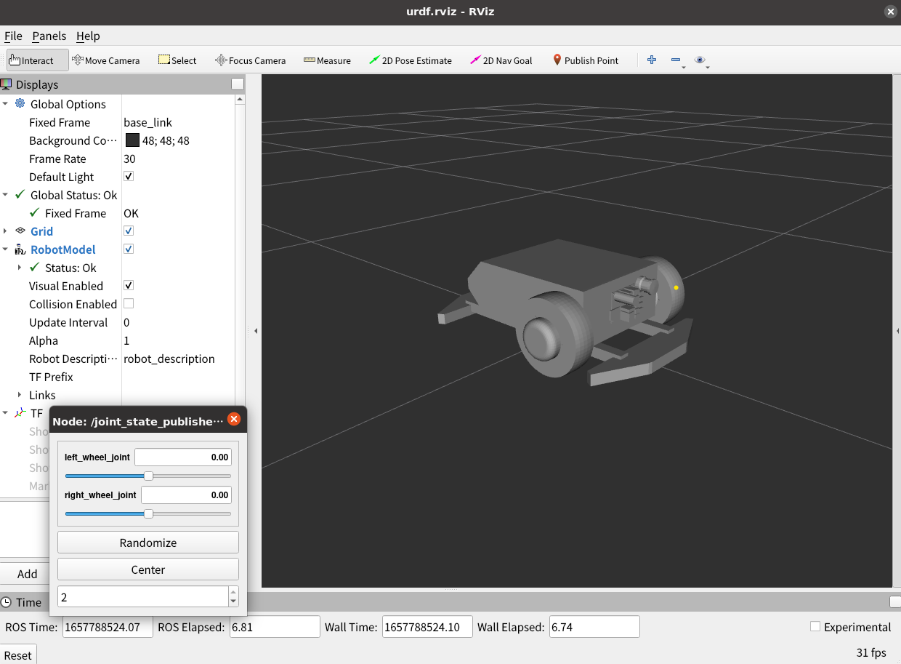

# メガローバーの3Dモデルのパッケージ



## 準備
Ubuntu 24.04にROS 2 JazzyとGazebo Harmonicをインストールしてから、ワークスペースに本パッケージと`vs_rover_options_description`を配置してビルドします。
以下は`~/ros2_ws`に配置する手順です。
既にクローン済みのリポジトリがある場合、その`git clone`は省略してください。

```bash
source "$(dpkg-query -L ros-jazzy-ros-workspace | awk '/\/setup\.bash$/ {print; exit}')"
mkdir -p ~/ros2_ws/src
cd ~/ros2_ws/src
git clone --branch jazzy https://github.com/vstoneofficial/megarover_description.git megarover_description
git clone --branch jazzy https://github.com/vstoneofficial/vs_rover_options_description.git vs_rover_options_description
cd ~/ros2_ws
rosdep install --from-paths src --ignore-src --rosdistro jazzy -y
colcon build --symlink-install --packages-select vs_rover_options_description megarover_description
source install/setup.bash
```

以降のコマンドは、`~/ros2_ws`で実行してください。

1. 対応するオプション
   - LRF TG30
   - バンパーセンサ
   - デプスカメラ Realsense D435i
   - カメラステー

2. 使用する機種のXacro内で、オプションのコメントを解除してください。D435iにはカメラステーが必要です。変更後は再ビルドしてください。

## 構成

- `urdf/`
  - 各ロボットの Xacro、Gazebo 用定義、ros2_control 用定義
- `meshes/`
  - 3D モデル
- `launch/`
  - RViz 表示用 launch
- `rviz/`
  - RViz 設定ファイル
- `params/`
  - ros2_control のコントローラ設定
- `scripts/`
  - 補助ノードや設定ファイル


## RViz上の可視化

ロボットモデルを表示します。`rover:=` で機種を切り替えます。

```bash
ros2 launch megarover_description display.launch.py rover:=mega3
```

`rover:=` で指定できる値:
- `mega3`
- `mega3_outdoor`
- `f120a`
- `s40a_lb`

### メガローバーVer 3.0を表示する場合:
```bash
ros2 launch megarover_description display.launch.py rover:=mega3
```


### mega3_outdoorを表示する場合:
```bash
ros2 launch megarover_description display.launch.py rover:=mega3_outdoor
```


### F120Aを表示する場合:
```bash
ros2 launch megarover_description display.launch.py rover:=f120a
```


### S40A_LBを表示する場合:
```bash
ros2 launch megarover_description display.launch.py rover:=s40a_lb
```

## Gazebo Harmonicでのシミュレーション

`rover:=`で、RVizと同じ機種を指定します。

```bash
ros2 launch megarover_description gazebo.launch.py rover:=mega3
```

別の端末でワークスペースを読み込み、`rover_twist`に速度指令を送ります。

```bash
cd ~/ros2_ws
source install/setup.bash
ros2 topic pub --once /rover_twist geometry_msgs/msg/Twist '{linear: {x: 0.2}}'
```

停止するときは速度を0にします。終了はGazeboを起動した端末でCtrl+Cを押してください。

```bash
ros2 topic pub --once /rover_twist geometry_msgs/msg/Twist '{}'
```
