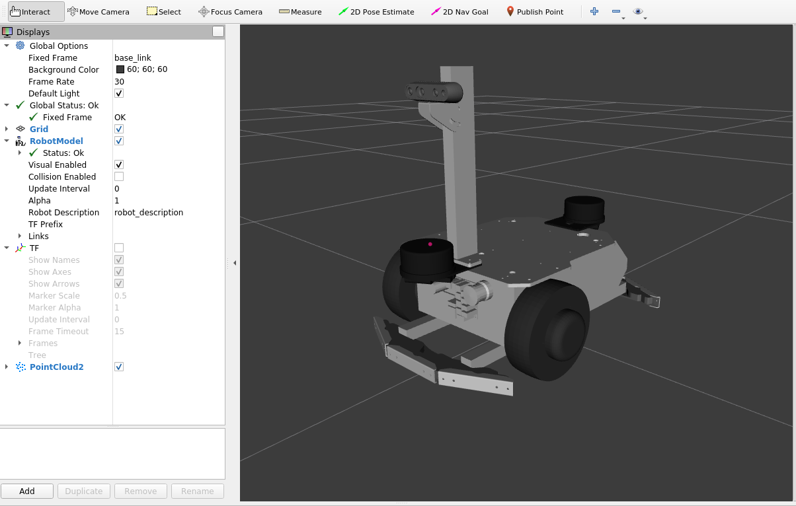
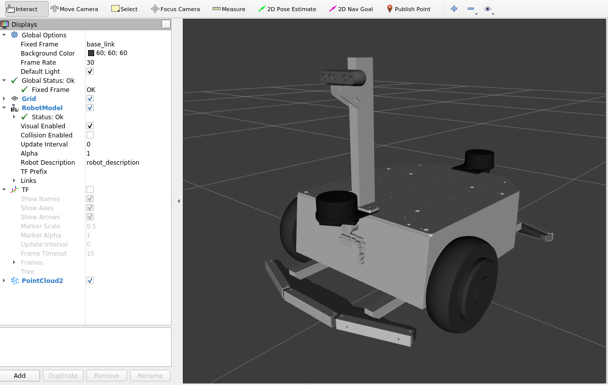

# メガローバーの3Dモデルのパッケージ

## 準備
ヴイストンの台車ロボットのオプションを表示する場合は、`vs_rover_options_description`というパッケージを`src`フォルダーにクローンしてください。（詳細は[こちら](https://github.com/vstoneofficial/vs_rover_options_description.git)を参照してください）
```bash
git clone -b $ROS_DISTRO https://github.com/vstoneofficial/vs_rover_options_description.git
```
> 1. 対応するオプション
>   - LRF TG30
>   - バンパーセンサ（メガローバー：前後）
>   - デプスカメラ　Realsense D435i
>   - カメラステー
> 
> 2. 使用状況に応じて、[mega3.xacro](./urdf/mega3.xacro), [f120a.xacro](./urdf/f120a.xacro)ファイルの6~18行目にある使用しないオプションをコメントアウトしてください。

## RViz上の可視化
以下のコマンドで立ち上げます。\
デフォルトでは`rover_type`に`mega3`が与えられています。
### メガローバーVer 3.0の場合は
```bash
ros2 launch megarover_description mega3_view.launch.py
```


### メガローバーF120Aの場合は
```bash
ros2 launch megarover_description f120a_view.launch.py
```

